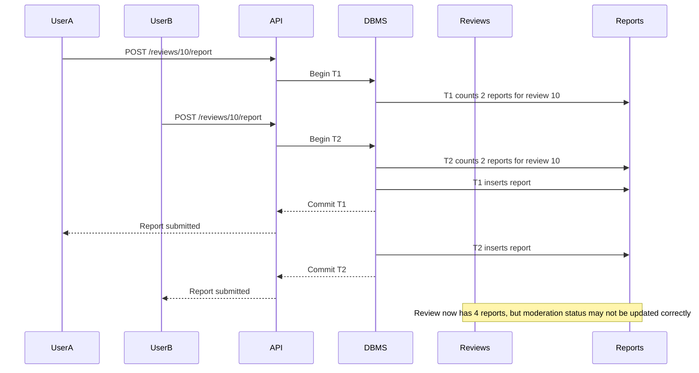

# Concurrency Control

## 1. Lost Update / Write Skew: Two Users Report the Same Review

Our service allows users to report reviews using `POST /reviews/{review_id}/report`. A possible future rule is that once a review receives a certain number of reports, it should be hidden or flagged for moderation. If two users report the same review at the same time, both transactions might read the same current report count before either report is committed. This could cause the system to make the wrong moderation decision.

For example, suppose a review already has 2 reports and the threshold for hiding a review is 3 reports. Two users report the review at the same time. Both transactions might read that the review has 2 reports. Then both insert a new report, but neither transaction correctly handles the fact that the review has crossed the threshold.

