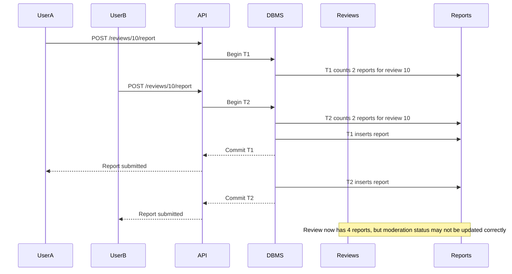
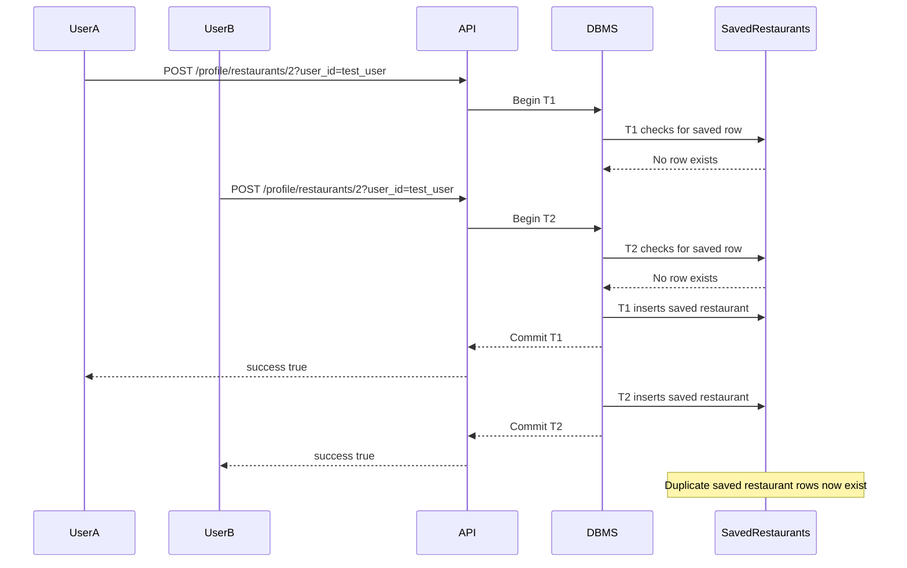

# Concurrency Control

## 1. Lost Update / Write Skew: Two Users Report the Same Review

Our service allows users to report reviews using `POST /reviews/{review_id}/report`. A possible future rule is that once a review receives a certain number of reports, it should be hidden or flagged for moderation. If two users report the same review at the same time, both transactions might read the same current report count before either report is committed. This could cause the system to make the wrong moderation decision.

For example, suppose a review already has 2 reports and the threshold for hiding a review is 3 reports. Two users report the review at the same time. Both transactions might read that the review has 2 reports. Then both insert a new report, but neither transaction correctly handles the fact that the review has crossed the threshold.

To prevent this, the report transaction should lock the review row with SELECT ... FOR UPDATE before inserting the report and counting total reports. This works because the moderation decision belongs to one review, so locking that one review forces report-count decisions for that review to happen one at a time. We should also keep the report insert and report-count check inside one transaction.

---

## 2. Phantom Read / Phantom Insert: Two Requests Save the Same Restaurant

Our service allows users to save restaurants using `POST /profile/restaurants/{restaurant_id}/`. The endpoint first checks whether the restaurant exists, then checks whether the current user has already saved that restaurant. If no saved row exists, it inserts a new row into `saved_restaurants`.

If two save requests happen at the same time for the same user and same restaurant, both transactions may check the table and see that no saved restaurant row exists. Then both transactions insert a new row. This creates duplicate saved restaurants for the same user.

This is closest to a phantom read because both transactions make a decision based on the absence of a row, but another transaction inserts that row before the first transaction is safely finished. Under Read Committed, this can happen because each statement sees only data committed before that statement begins. Repeatable Read may prevent some repeated-read inconsistencies, but we can also prevent a duplicate inserts by using a constraint, like on (user_id, restaurant_id) being unique.

